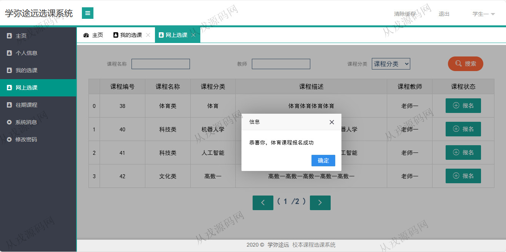

<h1 align="center">146.学生选课管理系统</h1>

 获取sql文件 QQ: 386869957 QQ群: 377586148 

 [更多源码项目: 从戎源码网](https://armycodes.com/) 

## 简介

> 本代码来源于网络,仅供学习参考使用!
>
> 提供1.远程部署/2.修改代码/3.设计文档指导/4.框架代码讲解等服务
> 
> 访问地址：http://localhost:8080/pages/index.html
>
> 老师：tea001 tea001
> 
> 学生：stu001 stu001

## 项目介绍
基于ssm的学生选课管理系统：前端 html、jquery，后端 springmvc、spring、mybatis；角色分为：老师、学生；集成课程管理、上传成绩、选课等功能于一体的系统。

## 功能介绍

- 基本功能：登录，注册，退出
- 我的课程：教师可以增加自己的课程供学生选择，可以查看当前课程有哪些学生选择
- 上传成绩：课程列表展示，双击课程可以进入该课程下面上传学生成绩
- 个人信息：个人信息查询与修改，密码修改
- 系统消息：系统消息列表查询
- 我的选课：选课信息查询，课程退选
- 网上选课：课程列表查询，关键词搜索，课程报名
- 往期课程：课程列表查询，导出成绩为word文档

## 环境

- <b>IntelliJ IDEA 2021.3</b>

- <b>Mysql 5.7.26</b>

- <b>Tomcat 7.0.73</b>

- <b>JDK 1.8</b>

## 运行截图

